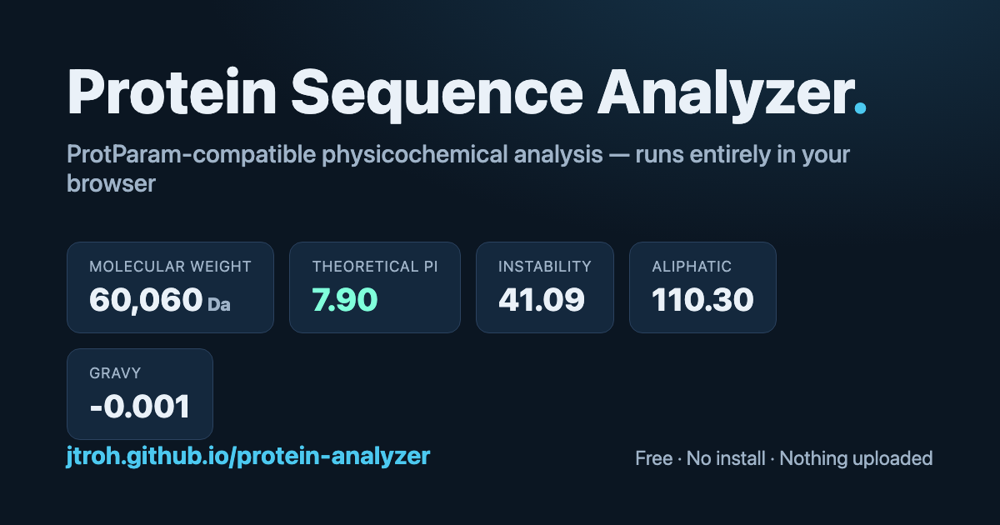

# Protein Sequence Analyzer

A single-page, browser-based protein analysis tool. Paste an amino-acid
sequence — raw, line-wrapped, or FASTA (single or multiple records) — and get
physicochemical properties that match [Expasy ProtParam](https://web.expasy.org/protparam/).

### ▶︎ Try it: **https://jtroh.github.io/protein-analyzer/**

## Features

- Length, molecular weight (Da / kDa), theoretical pI
- Instability index (with stable/unstable verdict), aliphatic index, GRAVY
- Net charge at pH 7, charged-residue counts, extinction coefficients
- Full amino-acid composition table
- Interactive **net charge vs pH** curve with the pI marked
- **Numbered sequence** view (50 residues/line, blocks of 10), ProtParam-style
- Export: **Save as PDF** (styled report) and **CSV**

Everything runs **client-side** — no server, no build step, **nothing is
uploaded**. It works offline once loaded. On a phone, use *Share → Add to Home
Screen* for an app-like launcher.

## Methods

Calculations use the same constants as Expasy ProtParam:

- **pI / charge** — Bjellqvist pK values, Henderson–Hasselbalch summation
- **Instability index** — Guruprasad dipeptide weight values (DIWV)
- **Hydropathy (GRAVY)** — Kyte–Doolittle scale
- **Molecular weight** — average residue masses + one water
- **Extinction coefficient** — Tyr/Trp/cystine contributions at 280 nm

Outputs are verified to match ProtParam (e.g. the 539-aa PIV3 F protein:
MW 60060.37, pI 7.90, instability 41.09, aliphatic 110.30, GRAVY −0.001).

## Run locally

It's a single static file — just open `index.html` in any browser, or serve
the folder with any static server.

## License

[MIT](LICENSE) — free to use, modify, and redistribute with attribution.
